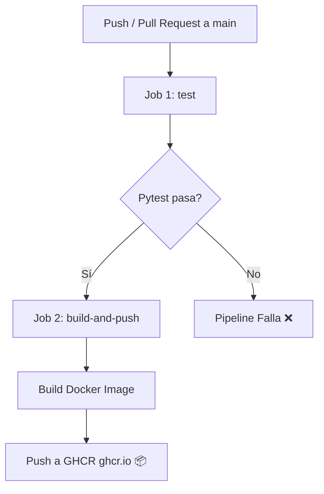

# TRABAJO-DIPLOMADO-BD: Pipeline CI/CD con GitHub Actions y Docker

Este repositorio contiene la implementación práctica de un flujo automatizado de **Integración Continua (CI)** y **Despliegue Continuo (CD)** utilizando **GitHub Actions** y **Docker**, basado en el tutorial *"CI/CD con GitHub Actions en MINUTOS"* de Emilio Carrión.

---

## 🚀 Arquitectura del Proyecto

El proyecto está compuesto por:
1. **API REST en FastAPI** (`app/main.py`): Servidor web liviano con endpoints `/` y `/health`.
2. **Pruebas Automatizadas con Pytest** (`tests/test_main.py`): Suite de tests unitarios ejecutables mediante `pytest`.
3. **Contenedor Docker** (`Dockerfile`): Imagen basada en `python:3.11-slim` expuesta en el puerto 8000.
4. **Workflow de GitHub Actions** (`.github/workflows/ci-cd.yml`): Pipeline automatizado para pruebas y publicación en GitHub Container Registry (GHCR).

---

## 🛠️ Ejecución Local

### 1. Requisitos Previos
- Python 3.11+ instalado.
- Docker instalado (opcional, para ejecución en contenedor).

### 2. Ejecutar la Aplicación en Local

```bash
# Crear entorno virtual
python -m venv .venv
source .venv/bin/activate  # En Windows: .venv\Scripts\activate

# Instalar dependencias
pip install -r requirements.txt

# Ejecutar la API
uvicorn app.main:app --reload
```

Accede a la API en: `http://127.0.0.1:8000`  
Documentación Swagger UI: `http://127.0.0.1:8000/docs`

### 3. Ejecutar Pruebas Unitarias

```bash
pytest -v
```

### 4. Construir y Ejecutar el Contenedor Docker

```bash
# Construir imagen
docker build -t trabajo-diplomado-bd .

# Correr contenedor
docker run -d -p 8000:8000 trabajo-diplomado-bd
```

---

## ⚙️ Flujo CI/CD con GitHub Actions

El archivo `.github/workflows/ci-cd.yml` define dos trabajos (*jobs*) automatizados:



1. **Job `test`**:
   - Descarga el código (`actions/checkout@v4`).
   - Configura el entorno Python 3.11.
   - Instala las dependencias definidas en `requirements.txt`.
   - Ejecuta `pytest -v` para garantizar la estabilidad del software.

2. **Job `build-and-push`**:
   - Depende de que el job `test` termine con éxito (`needs: test`).
   - Autentica el runner con **GitHub Container Registry (`ghcr.io`)** mediante el secreto implícito `${{ secrets.GITHUB_TOKEN }}`.
   - Construye la imagen Docker utilizando Docker Buildx.
   - Publica la imagen en GHCR bajo las etiquetas `:latest` y `:${{ github.sha }}`.

---

## 🌐 Repositorio Oficial
- Repositorio GitHub: [https://github.com/tadiaz23-jpg/TRABAJO-DIPLOMADO-BD](https://github.com/tadiaz23-jpg/TRABAJO-DIPLOMADO-BD)
